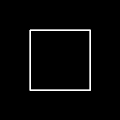
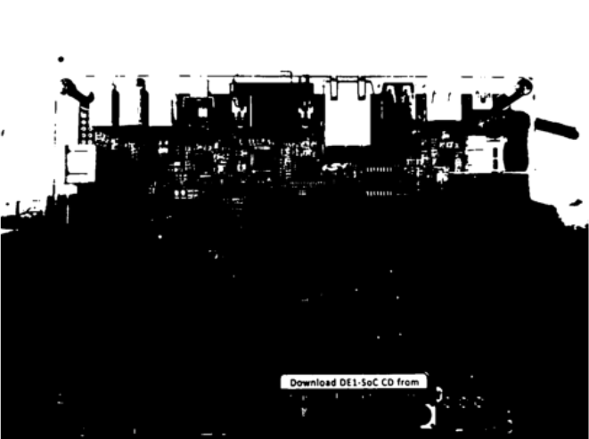
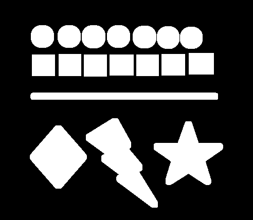

# Digital Image Processing

Welcome to the Digital Image Processing repository! This repository contains all the basics required to get started with digital image processing.

## NoteBooks

The repository contains a series of Jupyter Notebooks, each covering a specific topic related to **Digital Image Processing** basics. These notebooks are organized topic-wise, making it easy for learners to follow along and grasp the concepts progressively.

Explore the notebooks 📒 in the following order:

### Notebooks Series

The brief overview of what each notebook contains:

### [01. Draw Basic Shapes](01_Draw_Basic_Shapes.ipynb)
Introduction to drawing basic shapes such as line, circle, rectangle, and ellipse using OpenCV functions.

| Line | Circle | Rectangle | Ellipse |
|------|--------|-----------|---------|
|  |  |  |  |

### [02 Play With Patterns](02_Play_With_Patterns.ipynb)
Introduction to drawing patterns using OpenCV and numpy functions.

| Half White and Half Black | Gradient Image |Four-Quadrant BW Image |Four-Quadrant RGBW Image |
|---------------------------|----------------|-----------------------|-------------------------|
|  |  |  | |

### [03 Color Spaces](03_Color_Spaces.ipynb) 
Color spaces are mathematical models that define how colors are represented in digital form. This notebook covers fundamental colour channels for digital images.

| Colo Space |
|------------|
||
| |
||
||

### [04 Channel Representation](04_Channel_Representation.ipynb)
A digtal image is combination of multiple channels, representing these channels individually allows us to visualize the contribution of each color component to the overall image. Below is an example for RGB image

| Individual Channel Representation - RGB Color Space |
|-----------------------------------------------------|
||

### [05 Sampling and Quatization](05_Sampling_And_Quatization.ipynb)
Sampling in image is converting the continuous variation of pixel intensity into a grid of discrete pixels. The sampling rate affects the level of detail captured in the digital image.

| Sampling |
|----------|
||

Quantization in image refers to number of distinct intensity levels used to represent an image's pixels. For example, an 8-bit image allows for 256 levels of intensity per channel, ranging from 0 to 255.  

| Quantization |
|----------|
||

### [06. Geometric Transformation](06_Geometric_Transformations.ipynb)

Geometric transformations are fundamental operations in image processing that involve altering the spatial arrangement of pixels within an image.

| Shift | Scale | Rotate | ShearX | ShearY |
|-------|-------|--------|--------|---------|
||||||

### [07. Image Thresholding](07_Image_Thresholding.ipynb)

Image thresholding is used to segment an image into regions based on pixel intensity values. The process involves selecting a threshold value, which acts as a cutoff point, and classifying each pixel in the image as either foreground or background depending on whether its intensity value is above or below the threshold.

|Original Image|Global thresholding (v=127)|Adaptive Mean Thresholding|Adaptive Gaussian Thresholding|
|-------|-------|--------|--------|
|||||

### [08. Image and Kernels]()

### [09. Morphological Transformations](09_Morphological_Transformations.ipynb)

Morphological operations are a set of image processing techniques used for analyzing and processing geometric structures within images.
| Original | Dilate | Erode | Close |
|-------|-------|--------|--------|
|||||

| Open | Gradient | Skeleton |
|------|----------|----------|
||||

### [10. Affine Transformation and Perspective Transformation](10_Affine_And_Perspective_Transformation.ipynb)

- **Perspective transformation** is a geometric operation used in image processing to alter the appearance of an image by adjusting its perspective view.
- **Affine transformation** is a geometric operation that includes translation, rotation, scaling, and shearing, preserving parallelism and ratios of distances between points.

| Affine Transformation | Perspective Transformation | 
|-----------------------|----------------------------|
|||
